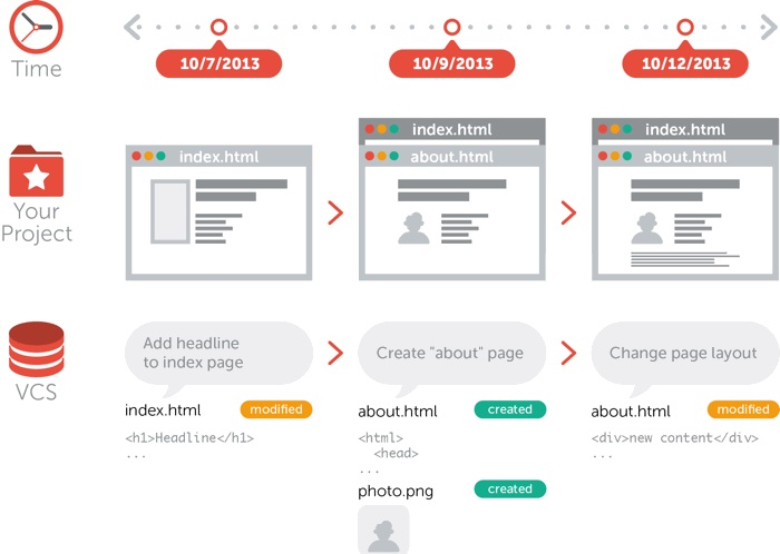

# GIT HUB

#### What is Version Control?

- A software utility that tracks and manages changes to a
  filesystem.
- Also known as revision control or source control system
- It's a management of changes to documents, computer
  programs, large websites and other collection of
  information
- A software utility that tracks and manages changes to a
  filesystem.
- Also known as revision control or source control system
- It's a management of changes to documents, computer
  programs, large websites and other collection of
  information

# VCS Kind of Database

- vcs options include Git, Mercurial, SVN and preforce.
- You can think of a vcs as a kind of "database".
- It lets you save a snapshot of your complete project at any
  time you want
- When you later take a look at an older snapshot your vcs
  shows you exactly how it differed from the previous one



# VCS is independent

VCS is independent of kind of project / technology / framework you're working with

- it works just as well for and HTML website as it does for a design project or Iphone App
- it lets you work with any tool you like ; it does not care what kind of text editor , graphics program , file manager or other tool you use

# Why Use VCS: Collaboration

- without a VCS in place , your probably working together in a shared in a shared folder on the same set of files.
- And you have to coordinate with others so that they don't work on same file, it will be very difficult to manage.
- what a VCS, everybody on the team is able to work absolutely freely - on any file at any time.
- the VCS will later allow you to merge all the changes into a common version.

# Why use VCS: Storing Version

### Storing Versions (Properly)

- Saving a version of your project after making changes is an essential habit. But without a VCS, this becomes tedious and confusing very quickly
- How much do you save? Only the changed files of rhe complete project.
- How do you name these version? "my App_2013-11-34_v23"
- the most important question: How do you know what exactly is different in these versions?

### Why Use a version control System.

- Version control system acknowledgement that here is only one project
- Therefore ,there only the one version on your disk that you'r currently working on.
- Everything else - all the past versions and variants - are neatly packed up inside the VCS.
- When you need it , you can request any version at any time and you'll have snapshot of the complete project right at hand

### Why use VCS: Restoring Previous Version

- Restoring Previous Version;

* Being able to restore the previous version of a file whole project.
* if the changes you've made. all you need for recovery is one of your teammates local Git repository

### Different Types of VCS.

#### VSS VISUAL SOURCE SAFE

Microsoft version control program , Oriented towards small software development projects.
its problem is that any one work in file if he will lock but it is good but is not reliable in now area age.

### SVN (APACHE SUBVERSION)

- SVN IS THE ABBREVIATED FRO MOF APACHE SUBVERSION AND IS A POPULAR VERSION CONTROL SYSTEM.

- but is the problem is that every user has the partial copy of the code , if you will change the code you will send to the central and receive from the central
- it is centralized version control system.

### GIT

- git is a distributed version control system for tracking changes in source code during software development.
  It is designed for coordinate work among programmers, but it can be used to track changes in any set of files.

### CVCS

- centralized Version Control System

### DVCS

- Distributed version control system
  git is Distributed version control system
  when you working on Git you have a copy of code etc , you can upload your copy of code .
- you can push pull and update the code.
  

- if the central server gets crashed at any point of time, the lost data can easily recovered from any one of the contributors local repository.

# Installation and Basic workflow.

#### installing and basic setup of Git

[ https://git-scm.com/downloads](https://git-scm.com/downloads);

installation Guide Windows;
[https://git-scm.com/book/en/v2/Getting-Started-Installing-Git](https://git-scm.com/book/en/v2/Getting-Started-Installing-Git)

installation Guide Linux;
[https://git-scm.com/download/linux](https://git-scm.com/download/linux)

installation Guide Window;
[https://git-scm.com/download/win](https://git-scm.com/download/win)

### Configuring Git

A couple of very basic configurations should be made before you get started.
You should set your name and email address as well as enable coloring to pretty
up command outputs:

```js
 git config --global user.name “Hassanhabibtahir”
 git config --global user.email “Hassanhabib@thir.org”
 git config --global color.ui auto
```

Basics Operations in Git are.

- initialize
- Add
- Commit
- Pull
- Push

Advanced Operations in Git are

- Branching
- Merging
- Rebasing

### Repository

Think of a repository as a kind of database where you your VCS as a kind of database where your VCS stores all the versions and metadata that accumulate in the course of your project.
In Git the repository is just a simple hidden folder name ".git"

### Staging Area;

staging area is a virtual place that collects all the files you want to include in next comment.
In Git, simple making some changes does not mean they are automatically committed.


### Stating with an un versioned ,Local Project

Open terminal and create directory on your machine

- C:\Users\myproject
- Go into directory in terminal
- initialize repository in this directory

```js
  git init
- 2 this will create .git hidden folder in your directory which will make your current folder, a git repository
- 3 create first.text
- 4 git status show you untracked files
- 5 Add these files to your staging area.
  - tow way to add files to staging area
  * git add first.text
  * git add .
  * git commit -m "message"
    git commit is very important you provide a proper commit message so that it can be refer back to identify what was added in that commit.
  * git log
```

### Reset git changing

git reset unstage the file

```js
 git reset
  git reset --hard unstage and also remove the changing in the file
 git reset --hard
```

### Ignore Files

- Typically , in every project add on every platform there are a couple of files that you don't want to be version controlled.

* .DS_Store
* NODE_ENV
* node_modules
* build
* logs

### Branching & Merging

why branching are important;

- in every project , there are always multiple different contexts where work happens;
- Each feature, bugfix , experiment or alternative of your product is actually a context of its own;
- there can me unlimited amount of different contexts
- mostly like , you 'll have at least on context for your main of production state ,and another context for each feature, bugfix , experiment or alternative of your etc.

### Context in Projects;

In real-world projects,work always happens in multiple of these contexts in parallel

- while you're preparing two new variants of your website design context,
- you're also trying to fix an annoying bug (context 3);
- On the side , you also update some content on your FAQ pages context4;
- one of your teammates is working on a new feature for your shopping cart context5;
- and another colleague is experiment with a whole new login functionality context6;

### why branches are important;

Another example

- Production , development and feature context;
- production code is tested and deployed and we don't want any problem in that.
- Development team is working on new features and we don't want that feature to effect production code until it properly tested.

### Working with branches Branches;

- without knowing ,we were already working on a branch
- This is because branch aren't optional git,
  you are always working on a branch the currently active , or "checked out"
  or "HEAD" branch
- check git status and it will show you current branch
- the master branch was created by Git automatically for us when we started the project.

### git Branch Commands;

- show list of branches;

```js
   git branch-v
```

- Create Git Branch without switching
  create a new branch with name dev

```js
git branch new-developer
```

switch to new branch;

```js
switch to new-developer
```

### Merging;

Merge new-developer branch into current active branch;

```js
git merge new-developer
```

- git log new-developer master
  show commit different in two branches

  ```js
  git log new-developer..master
  ```

  -merge the code in master branch or main.

```js
git merge dev
```

- if you have changing a two branches,
  like change and commit in main and other branches;
  when you merge the two branches together it will create a new branch that the name of other you have to merge

### Stash

Commit wraps up changes and saves them permanently in the repository
Stash save changes temporarily some time you don't want to commit

- git stash (add code temporarily)
- git stash pop( remove from stash and add to branch)
- git stash save name (can apply stash with name as like )

```git
git stash apply stash@{0}
```

```bash
git stash
git stash save name
git stash list
git stash pop
git stash apply stashname
```

### Remote Repository

- About 90% of version control related work happens in the local repository:
- Staging ,committing ,viewing the status or the log/history etc.
- if you're the only person working on your project, chances are you'll never need to set up remote repository.
- Only when it comes to sharing data with your teammates, a remote rep comes into play.
  - github
  - gitBucket
  - gitLab

#### show remote url

```bash
git remote -v
```

#### show details of origin.

```bash
git remote show origin
```

#### Commands to interact remote repository

```bash
 git remote add myremote
```

#### Commands to interact remote repository and branch so it will show logs from that branch of remote.

```bash
 git log remote/branch
```

#### git remote add

- add origin with name

```bash
git remote add hi ( origin link);
git remote show hi;

```

- push code with origin name

```bash
git push -u hi master(branch)

```
